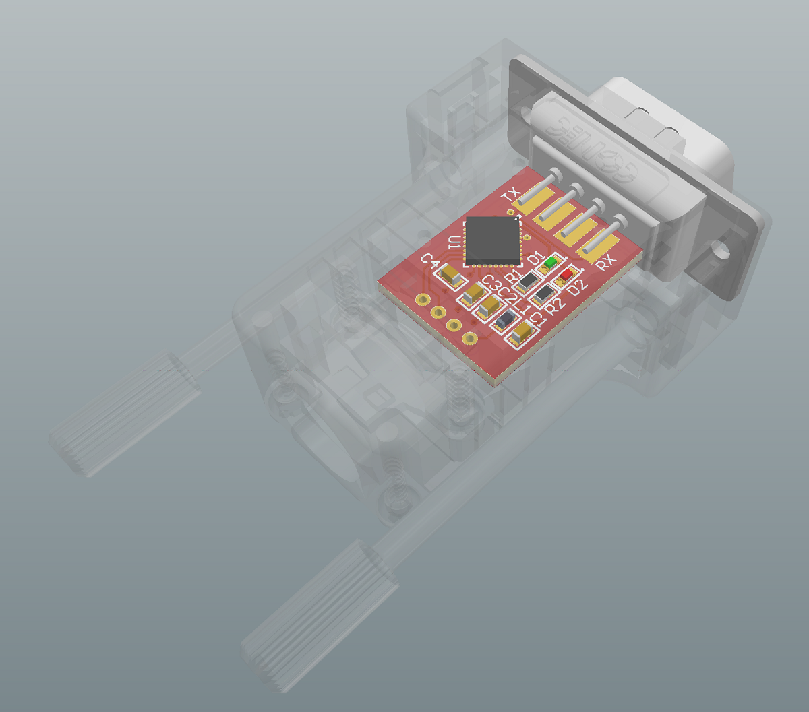

# EQDirect
USB Adaptor for Skywatcher EQ Mounts

Using a FTDI chip to directly connect a Skywatcher EQ Mount to a PC without the hand controller. The PCB fits into a CONEC DB9 connector case (P/N: 165X03309A).

## PCB

